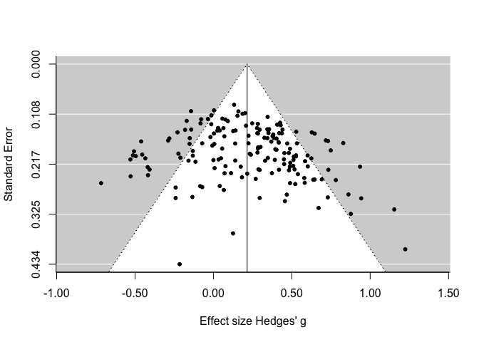

Step 1: Load necessary packages
-------------------------------

We use two libraries to conduct our meta-analyses: *meta* and *metafor*. Make sure both are installed and load them with the `library` call in *R*.

Step 2: General random effects model
------------------------------------

This is the first step in a meta-analysis, calculating the general random effects model with no moderators while trimming out the outliers and taking a single effect size per infant group (no repeated measures).

``` {.r}
grlmodel <- rma(ESg, sei = ESg.SE, data = db.noOutnoRM, weighted = TRUE)
summary(grlmodel)
```

    ## 
    ## Random-Effects Model (k = 168; tau^2 estimator: REML)
    ## 
    ##   logLik  deviance       AIC       BIC      AICc  
    ## -56.2540  112.5081  116.5081  122.7440  116.5812  
    ## 
    ## tau^2 (estimated amount of total heterogeneity): 0.0689 (SE = 0.0113)
    ## tau (square root of estimated tau^2 value):      0.2624
    ## I^2 (total heterogeneity / total variability):   70.08%
    ## H^2 (total variability / sampling variability):  3.34
    ## 
    ## Test for Heterogeneity: 
    ## Q(df = 167) = 512.8292, p-val < .0001
    ## 
    ## Model Results:
    ## 
    ## estimate       se     zval     pval    ci.lb    ci.ub          
    ##   0.2153   0.0250   8.6004   <.0001   0.1662   0.2643      *** 
    ## 
    ## ---
    ## Signif. codes:  0 '***' 0.001 '**' 0.01 '*' 0.05 '.' 0.1 ' ' 1

The estimate significantly above zero, and in the .2 region, a small but significant effect according to Cohen's (1988) criteria. Furtermore, heterogenity is significant, green light to look at moderators in targeted analyses.

Step 3: Inspect funnel plot for asymmetries
-------------------------------------------

``` {.r}
funnel(grlmodel,xlab="Effect size Hedges' g",pch = 20)
```


